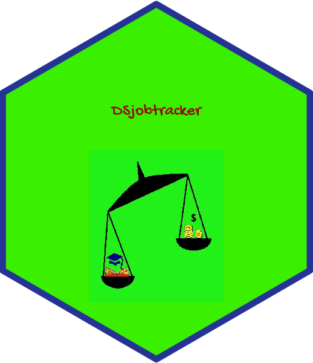

# DSjobtracker 

What skills and qualifications are required for data science related
jobs?

# Installation

``` r
#install.packages("devtools")
devtools::install_github("thiyangt/DSjobtracker")
library(DSjobtracker)
```

# Preview of the tidy dataset

```r
head(DStidy)
```

# Preview of the untidy dataset

``` r
head(DSraw)
```

    ##   ID Consultant DateRetrieved DatePublished
    ## 1  1   Thiyanga    05/08/2020          <NA>
    ## 2  2     Jayani    07/08/2020    31/07/2020
    ## 3  3     Jayani    07/08/2020      06/08/20
    ## 4  4     Jayani    07/08/2020    24/07/2020
    ## 5  5     Jayani    07/08/2020    24/07/2020
    ## 6  6     Jayani    07/08/2020    13/08/2020
    ##                                     Job_title
    ## 1                                        <NA>
    ## 2                       Junior Data Scientist
    ## 3          Engineer, Analytics & Data Science
    ## 4 CI-Statistical Analyst/Business Analyst-CMB
    ## 5                         DA-Data Analyst-CMB
    ## 6                              Data Scientist
    ##                                              Company R SAS SPSS Python MAtlab
    ## 1                                               <NA> 1   1   NA      1      1
    ## 2                                  Dialog Axiata PLC 1   0    0      1      0
    ## 3                 London Stock Exchange Group plc3.1 0   0    0      1      0
    ## 4                               E.D. Bullard Company 1   1    1      0      0
    ## 5                               E.D. Bullard Company 0   1    1      0      0
    ## 6 Emirates Center for Strategic Studies and Research 1   0    0      1      0
    ##   Scala C# MS Word Ms Excel OLE/DB Ms Access Ms PowerPoint Spreadsheets
    ## 1     0 NA      NA       NA     NA        NA            NA           NA
    ## 2     0  0       0        0      0         0             0            0
    ## 3     0  0       0        0      0         0             0            0
    ## 4     0  0       0        0      0         0             0            0
    ## 5     0  0       1        1      0         1             1            0
    ## 6     0  0       0        0      0         0             0            0
    ##   Data_visualization Presentation_Skills Communication BigData Data_warehouse
    ## 1                 NA                  NA            NA      NA             NA
    ## 2                  1                   0             0       1              1
    ## 3                  1                   0             0       1              0
    ## 4                  0                   0             0       0              0
    ## 5                  0                   0             0       0              0
    ## 6                  0                   0             0       0              0
    ##   cloud_storage Google_Cloud AWS Machine_Learning Deep Learning Computer_vision
    ## 1            NA           NA  NA               NA            NA               0
    ## 2             1            0   0                1             0               0
    ## 3             0            0   0                1             0               0
    ## 4             0            0   0                0             0               0
    ## 5             0            0   0                0             0               0
    ## 6             0            0   0                1             0               0
    ##   Java C++  C Linux/Unix SQL NoSQL RDBMS Oracle MySQL PHP Flash_Actionscript
    ## 1   NA  NA NA         NA   1    NA    NA     NA    NA  NA                 NA
    ## 2    0   0  0          0   0     0     0      0     0   0                  0
    ## 3    0   0  0          0   0     0     0      0     0   0                  0
    ## 4    0   0  0          0   1     0     0      0     0   0                  0
    ## 5    0   0  0          0   1     0     0      1     1   0                  0
    ## 6    1   1  1          0   1     0     0      0     0   0                  0
    ##   SPL web_design_and_development_tools Wordpress AI
    ## 1  NA                               NA        NA NA
    ## 2   0                                0         0  0
    ## 3   0                                0         0  0
    ## 4   0                                0         0  0
    ## 5   0                                0         0  0
    ## 6   0                                0         0  0
    ##   Natural_Language_Processing(NLP) Microsoft Power BI Google_Analytics
    ## 1                               NA                 NA               NA
    ## 2                                0                  0                0
    ## 3                                1                  1                0
    ## 4                                0                  0                0
    ## 5                                0                  0                0
    ## 6                                0                  0                0
    ##   graphics_and_design_skills Data_marketing SEO Content_Management Tableau D3
    ## 1                         NA             NA  NA                 NA      NA NA
    ## 2                          0              0   0                  0       0  0
    ## 3                          0              0   0                  0       0  0
    ## 4                          0              0   0                  0       0  0
    ## 5                          0              0   0                  0       0  0
    ## 6                          0              0   0                  0       0  0
    ##   Alteryx KNIME Spotfire Spark S3 Redshift DigitalOcean Javascript Kafka Storm
    ## 1      NA    NA       NA    NA NA       NA           NA         NA    NA    NA
    ## 2       0     0        0     0  0        0            0          0     0     0
    ## 3       0     0        0     0  0        0            0          0     0     0
    ## 4       0     0        0     0  0        0            0          0     0     0
    ## 5       0     0        0     0  0        0            0          0     0     0
    ## 6       0     0        0     1  1        1            1          1     0     0
    ##   Bash Hadoop Data_Pipelines MPP_Platforms Qlik Pig Hive Tensorflow Map/Reduce
    ## 1   NA     NA             NA            NA   NA  NA   NA         NA         NA
    ## 2    0      0              0             0    0   0    0          0          0
    ## 3    0      0              0             0    0   0    0          0          0
    ## 4    0      0              0             0    0   0    0          0          0
    ## 5    0      0              0             0    0   0    0          0          0
    ## 6    0      0              0             0    0   0    0          0          0
    ##   Impala Solr Teradata MongoDB Elasticsearch YOLO agile execution
    ## 1     NA   NA       NA      NA            NA   NA              NA
    ## 2      0    0        0       0             0    0               0
    ## 3      0    0        0       0             0    0               0
    ## 4      0    0        0       0             0    0               0
    ## 5      0    0        0       0             0    0               0
    ## 6      0    0        0       0             0    0               0
    ##   Data_management pyspark Data_mining Data_science Web_Analytic_tools IOT
    ## 1              NA      NA          NA           NA                 NA  NA
    ## 2               0       0           0            0                  0   0
    ## 3               0       0           0            0                  0   0
    ## 4               0       0           0            0                  0   0
    ## 5               0       0           0            0                  0   0
    ## 6               0       0           1            0                  0   0
    ##   Numerical_Analysis Economic Finance_Knowledge Investment_Knowledge
    ## 1                 NA       NA                NA                   NA
    ## 2                  0        0                 0                    0
    ## 3                  0        0                 0                    0
    ## 4                  0        0                 0                    0
    ## 5                  0        0                 0                    0
    ## 6                  0        0                 0                    0
    ##   Problem_Solving Korean_language Bash\\Linux Scripting
    ## 1              NA              NA                    NA
    ## 2               0               0                     0
    ## 3               0               0                     0
    ## 4               0               0                     0
    ## 5               0               0                     0
    ## 6               0               0                     0
    ##                      Knowledge_in Experience         City Location
    ## 1                            <NA>         4+         <NA>       NY
    ## 2                      Not_define        2-3      Colombo       SL
    ## 3 Elasticsearch, Logstash, Kibana        1-2      Colombo       SL
    ## 4                      Not_define         2+      Colombo       SL
    ## 5                      Not_define Not_define      Colombo       SL
    ## 6                      Not_define        5-7 Kuala Lumpur Malaysia
    ##                                                                                             Educational_qualifications
    ## 1                                                                                                                 <NA>
    ## 2 Degree in Engineering / IT or specialized in Computer Science / Statistics from a recognized university or institute
    ## 3                                                               Degree in Statistics / Mathematics / Computer Science.
    ## 4                                                       Undergraduate degree in statistics, mathematics or engineering
    ## 5  Bachelor's in Information Management, Information Technology, Computing, Mathematics, Statistics, or related fields
    ## 6                    Master<U+0092>s or PHD in Statistics, Mathematics, Computer Science or another quantitative field
    ##       Salary Team_Handling Debtor_reconcilation Payroll_management Bayesian
    ## 1       <NA>            NA                   NA                 NA       NA
    ## 2 Not_define             0                    0                  0        0
    ## 3 Not_define             0                    0                  0        0
    ## 4 Not_define             0                    0                  0        0
    ## 5 Not_define             0                    0                  0        0
    ## 6 Not_define             0                    0                  0        0
    ##   Optimization Bahasa Malaysia English proficiency
    ## 1           NA              NA                <NA>
    ## 2            0               0          Not_define
    ## 3            0               0          Not_define
    ## 4            0               0          Not_define
    ## 5            0               0          Not_define
    ## 6            0               0          Not_define
    ##                                                                                                                                                                                                                                                                                                                                                                                                                                                                                                                                                                                                                                                                                                                                                                                                                                                                             URL
    ## 1                                                                                                                                                                                                                                                                                                                                                                                                                                                                                                                                                                                                                                                                                                                                                                                                                                                                          <NA>
    ## 2 https://www.google.com/search?sxsrf=ALeKk00MUun1FouYtWJYm7L0o3wlM5pWbA:1596811359019&source=hp&ei=XmgtX9XyO-G_8QOttrSQAg&q=latest+jobs+for+data+scientist&oq=Latest+Jobs+for+data+scie&gs_lcp=CgZwc3ktYWIQAxgAMggIIRAWEB0QHjIICCEQFhAdEB4yCAghEBYQHRAeMggIIRAWEB0QHjIICCEQFhAdEB4yCAghEBYQHRAeMggIIRAWEB0QHjIICCEQFhAdEB4yCAghEBYQHRAeMggIIRAWEB0QHjoHCCMQ6gIQJzoECCMQJzoICAAQkQIQiwM6CAgAELEDEIMBOggILhCxAxCDAToFCAAQsQM6DggAELEDEIMBEJECEIsDOgsIABCxAxCDARCLAzoHCAAQAxCLAzoICC4QsQMQiwM6CAgAELEDEIsDOgUIABCLAzoCCAA6BggAEBYQHjoFCCEQoAFQ4RhY87gBYJ_IAWgCcAB4AIABwgOIAfQwkgEKMC4xNC43LjQuM5gBAKABAaoBB2d3cy13aXqwAQq4AQI&sclient=psy-ab&ibp=htl;jobs&sa=X&ved=2ahUKEwi7iIn-qYnrAhXS7XMBHR2PCx8Qp4wCMAB6BAgLEAE#fpstate=tldetail&htivrt=jobs&htiq=latest+jobs+for+data+scientist&htidocid=G184piKqa2o_fj-gAAAAAA%3D%3D&sxsrf=ALeKk00mvUvmmBGPtIAJqR8AKbUqgn_goA:1596811391427
    ## 3                                                                                                                                                                                                                                                                                                                                                                                                                                                                                                                                                                                                                                                                                                                                                                                          https://www.glassdoor.com/Job/sri-lanka-statistics-jobs-SRCH_IL.0,9_IN45_KO10,20.htm
    ## 4                                                                                                                                                                                                                                                                                                                                                                                                                                                                                                                                                                                                                                                                                                                                                                                          https://www.glassdoor.com/Job/sri-lanka-statistics-jobs-SRCH_IL.0,9_IN45_KO10,20.htm
    ## 5                                                                                                                                                                                                                                                                                                                                                                                                                                                                                                                                                                                                                                                                                                                                                                                          https://www.glassdoor.com/Job/sri-lanka-statistics-jobs-SRCH_IL.0,9_IN45_KO10,20.htm
    ## 6                                                                                                                                                                                                                                                                                                                                                                                                                                                                                                                                                                                                                                                                                         https://www.glassdoor.com/Job/jobs.htm?suggestCount=0&suggestChosen=false&clickSource=searchBtn&typedKeyword=&locT=N&locId=170&jobType=&context=Jobs&sc.keyword=statistics&dropdown=0
    ##                       Search_Term X109 X110 X111 X112 X113 X114 X115 X116 X117
    ## 1                            <NA>   NA   NA   NA   NA   NA   NA   NA   NA   NA
    ## 2 Data Analysis Jobs in Sri Lanka   NA   NA   NA   NA   NA   NA   NA   NA   NA
    ## 3 Data Analysis Jobs in Sri Lanka   NA   NA   NA   NA   NA   NA   NA   NA   NA
    ## 4 Data Analysis Jobs in Sri Lanka   NA   NA   NA   NA   NA   NA   NA   NA   NA
    ## 5 Data Analysis Jobs in Sri Lanka   NA   NA   NA   NA   NA   NA   NA   NA   NA
    ## 6 Statistics top jobs in Malaysia   NA   NA   NA   NA   NA   NA   NA   NA   NA
    ##   X118 X119 X120 X121 X122 X123 X124 X125 X126 X127 X128 X129 X130 X131 X132
    ## 1   NA   NA   NA   NA   NA   NA   NA   NA   NA   NA   NA   NA   NA   NA   NA
    ## 2   NA   NA   NA   NA   NA   NA   NA   NA   NA   NA   NA   NA   NA   NA   NA
    ## 3   NA   NA   NA   NA   NA   NA   NA   NA   NA   NA   NA   NA   NA   NA   NA
    ## 4   NA   NA   NA   NA   NA   NA   NA   NA   NA   NA   NA   NA   NA   NA   NA
    ## 5   NA   NA   NA   NA   NA   NA   NA   NA   NA   NA   NA   NA   NA   NA   NA
    ## 6   NA   NA   NA   NA   NA   NA   NA   NA   NA   NA   NA   NA   NA   NA   NA
    ##   X133 X134 X135 X136 X137 X138 X139 X140 X141 X142 X143 X144 X145 X146 X147
    ## 1   NA   NA   NA   NA   NA   NA   NA   NA   NA   NA   NA   NA   NA   NA   NA
    ## 2   NA   NA   NA   NA   NA   NA   NA   NA   NA   NA   NA   NA   NA   NA   NA
    ## 3   NA   NA   NA   NA   NA   NA   NA   NA   NA   NA   NA   NA   NA   NA   NA
    ## 4   NA   NA   NA   NA   NA   NA   NA   NA   NA   NA   NA   NA   NA   NA   NA
    ## 5   NA   NA   NA   NA   NA   NA   NA   NA   NA   NA   NA   NA   NA   NA   NA
    ## 6   NA   NA   NA   NA   NA   NA   NA   NA   NA   NA   NA   NA   NA   NA   NA
    ##   X148 X149 X150 X151 X152
    ## 1   NA   NA   NA   NA   NA
    ## 2   NA   NA   NA   NA   NA
    ## 3   NA   NA   NA   NA   NA
    ## 4   NA   NA   NA   NA   NA
    ## 5   NA   NA   NA   NA   NA
    ## 6   NA   NA   NA   NA   NA

## About the project

Project under [Statistical Consulting
Service](https://scs-fas-sjp.netlify.app/), University of Sri
Jayewardenepura, Sri Lanka.

### Our team and Contribution

Data collection and Entry: BSc (Hons) Statistics, 2020 Undergraduates

Hex sticker image design: 

Column key documentation: 

Data wrangling: 

Data wrangling documentation: 

